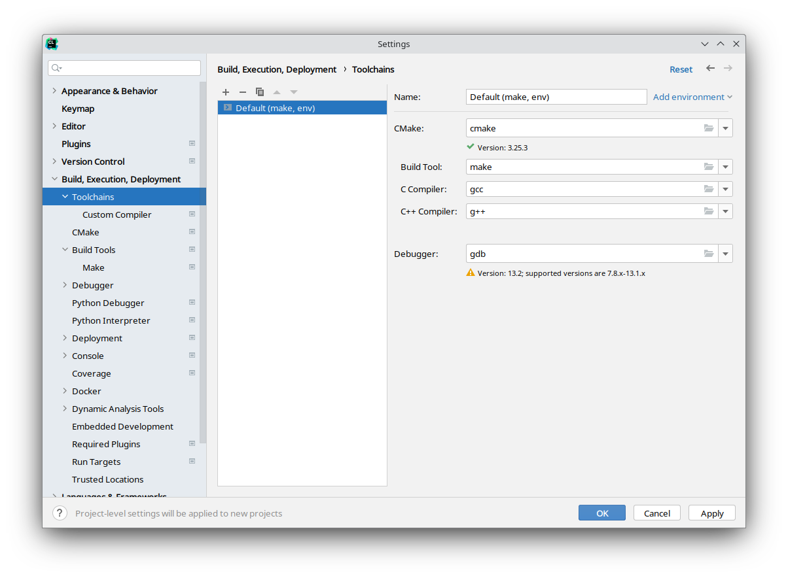
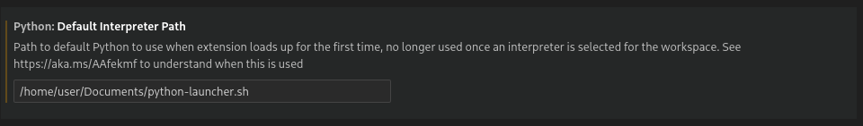
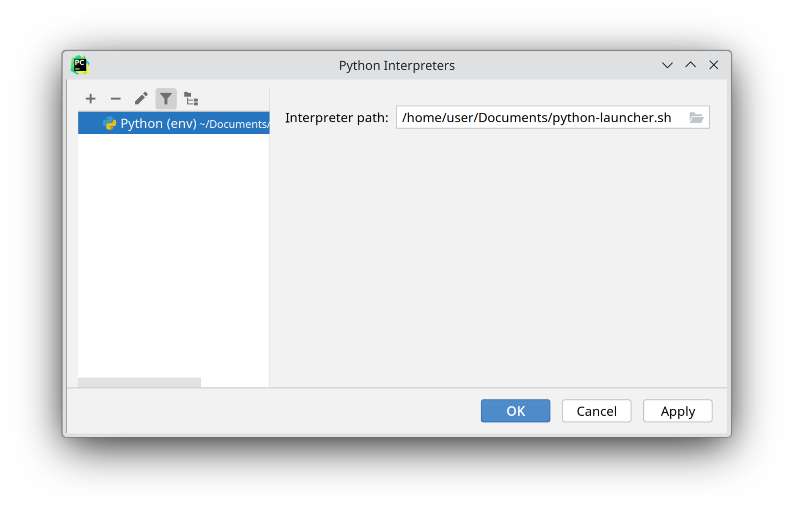

# IDE setup

All IDEs should be opened from a direct `nix-shell` package session, as is detailed in [Using the Nix packages](./nix.md).

e.g.

```
$ nix-shell -A env.nova-control
$ clion
```

## C++

ROS C++ packages use CMake, which is well supported by most IDEs.

### Visual Studio Code

Get the [C/C++](https://marketplace.visualstudio.com/items?itemName=ms-vscode.cpptools) and [CMake Tools](https://marketplace.visualstudio.com/items?itemName=ms-vscode.cmake-tools) extensions, and choose the ["unspecified" kit](https://code.visualstudio.com/docs/cpp/cmake-linux#_select-a-kit) when prompted.

These extensions are already preinstalled when using `nova.desktop.enable` in the Home Manager or NixOS modules.

### CLion

CLion supports CMake out of the box.

When using CLion, make sure to manually enter the build tool executable names
in a toolchain profile. This will force the IDE to use the tools in `PATH`
instead of using incorrect autodetection results.



## Python

Both Visual Studio Code and PyCharm are unable to use a Python interpreter directly from the `PATH` variable, which is a problem for `nix-shell`.

To work around this, create a shell script to launch Python, and set it as the Python interpreter.

```sh
#!/bin/sh
exec python "$@"
```

Make sure that you are able to execute this script before trying to get your IDE to run it with `./python-launcher.sh` 
(assuming you named it python-launcher.sh). To fix any permissions issues, you can run `chmod u+x ./python-launcher.sh` 
to make it executable.

### Visual Studio Code

Use the Python launch script in the `python.defaultInterpreterPath` setting.



These settings are already preconfigured when using `nova.desktop.enable` in the Home Manager or NixOS modules.

### PyCharm

Add a Python interpreter using the path to the Python launch script.



> Note: The PyCharm interpreter settings are quite buggy. You may need to add the interpreter and switch to it multiple times before it works correctly. Check that the interpreter path has saved correctly if it is not behaving as expected.

## Nix

### Visual Studio Code

Install the [Nix IDE](https://marketplace.visualstudio.com/items?itemName=jnoortheen.nix-ide) extention, along with [`nixd`](https://github.com/nix-community/nixd) and [`nixpkgs-fmt`](https://github.com/nix-community/nixpkgs-fmt). Then, add the following JSON settings:

```json
{
    "nix.enableLanguageServer": true,
    "nix.serverPath": "nixd",
    "nix.serverSettings": {
        "nixd": {
            "formatting": {
                "command": "nixpkgs-fmt"
            }
        }
    },

    "[nix]": {
        "editor.formatOnSave": true,
        "editor.formatOnPaste": true
    }
}
```


These settings are already preconfigured when using `nova.desktop.enable` in the Home Manager or NixOS modules.