# Nova Arm Controller

This controller is able to drive a BLCMD arm in joint space. 

### Position and velocity control

The use of position vs velocity control is determined by the parameter `use_position_control`.

## Controller chaining

Controller chaining was implemented by Bailey; please get in contact if you have questions!

Controller chaining allows us to compose a control system from many modular component controllers. In this case, this 
controller is used in tandem with inputs from an IK controller when in IK mode, or from inputs from a ROS2 topic when in 
FK/joint space control mode.

These are some resources on controller chaining from ROS2:
- [Controller Chaining / Cascade Control](https://control.ros.org/master/doc/ros2_control/controller_manager/doc/controller_chaining.html#implementation)
- [Example 12: Controller chaining with RRBot](https://control.ros.org/master/doc/ros2_control_demos/example_12/doc/userdoc.html)
- [Example 12 passthrough_controller.hpp](https://github.com/ros-controls/ros2_control_demos/blob/master/example_12/controllers/include/passthrough_controller/passthrough_controller.hpp)
- [Example 12 passthrough_controller.cpp](https://github.com/ros-controls/ros2_control_demos/blob/master/example_12/controllers/src/passthrough_controller.cpp)
- [Chaining Controllers roadmap design document](https://github.com/ros-controls/roadmap/blob/master/design_drafts/controller_chaining.md#example-2)

### Design overview

The controller includes one reference interfaces for each joint; either for velocity, or for position, depending on the 
control mode used. 

Other controllers can use these interface like normal command interfaces.

```mermaid
---
title: Controller in chained mode (for IK, using position control)
---
%%{init: {'themeVariables': { 'fontFamily': 'Monospace'}}}%%
flowchart LR
    classDef controller fill:#1f2020,stroke:#cccccc,stroke-width:2px,rx:10,ry:10 
    classDef hidden fill:#00000000,height:0,font-size:0pt
    classDef elipses fill:#00000000,stroke:#00000000,stroke-width:0,height:0,font-size:32pt

    subgraph reference_interfaces["`Reference
    interfaces`"]
        empty0["."]:::hidden
        ref_j1(nova_arm_controller/j1/position)
        ref_j2(nova_arm_controller/j2/position)
        elipses1[":"]:::elipses
        ref_j6(nova_arm_controller/j6/position)
    end
    
    subgraph nova_ik_controller["`nova_ik_controller`"]
        empty1["."]:::hidden
        _r_h1["."] ~~~ _r_h1b["."]
        _r_h2["."] ~~~ _r_h2b["."]
        _r_h3["."] ~~~ _r_h3b["."]
        _r_h6["."] ~~~ _r_h6b["."]
    end
    class nova_ik_controller controller;

    subgraph nova_arm_controller["`nova_arm_controller`"]
        empty2["."]:::hidden
        _h1["."] 
        _h1b["."]
        _h2["."] 
        _h2b["."]
        _h6["."] 
        _h6b["."]
    end
    class nova_arm_controller controller;

    subgraph hardware_interfaces["`
    Interfaces`"]
    empty3["."]:::hidden
    j1(j1/position)
    j2(j2/position)
    elipses2[":"]:::elipses
    j6(j6/position)
    end

    %% Hidden nodes to enforce straight horizontal alignment
    _r_h1b --> ref_j1 --> _h1 ~~~ _h1b -- cmd --> j1
    _r_h2b --> ref_j2 --> _h2 ~~~ _h2b -- cmd --> j2
    _r_h6b --> ref_j6 --> _h6 ~~~ _h6b -- cmd --> j6

    class _h1,_h1b,_r_h1,_r_h1b hidden;
    class _h2,_h2b,_r_h2,_r_h2b hidden;
    class _h3,_h3b,_r_h3,_r_h3b hidden;
    class _h6,_h6b,_r_h6,_r_h6b hidden;
```

Chainable controllers can be toggled between chained and non-chained mode. Irrespective of chained mode being enabled,
when not in chained mode, the controller maintains a ROS2 topic subscription to teleop inputs. When not in chained mode,
the controller runs `update_reference_from_subscribers`, which populates the reference interface values with those from
the most recently received ROS2 topic message.

```mermaid
---
title: Controller **not** in chained mode (using velocity control)
---
%%{init: {'themeVariables': { 'fontFamily': 'Monospace'}}}%%
flowchart LR
    classDef controller fill:#1f2020,stroke:#cccccc,stroke-width:2px,rx:10,ry:10 
    classDef hidden fill:#00000000,height:0,font-size:0pt
    classDef elipses fill:#00000000,stroke:#00000000,stroke-width:0,height:0,font-size:32pt
        
    subscription["`ROS2 topic subscription`"] ~~~ _hb["."]

    subgraph reference_interfaces["`Reference
    interfaces`"]
        empty1["."]:::hidden
            
        ref_j1(nova_arm_controller/j1/velocity)
        ref_j2(nova_arm_controller/j2/velocity)
        elipses1[":"]:::elipses
        ref_j6(nova_arm_controller/j6/velocity)
    end
    
    subgraph nova_arm_controller["`nova_arm_controller`"]
        empty2["."]:::hidden
        _h1["."]
        _h1b["."]
        
        _h2["."]
        _h2b["."]
        
        _h6["."]
        _h6b["."]
    end
    class nova_arm_controller controller;

    subgraph hardware_interfaces["`
    Interfaces`"]
        empty3["."]:::hidden
        j1(j1/velocity)
        j2(j2/velocity)
        elipses2[":"]:::elipses
        j6(j6/velocity)
    end

    ref_j1 --> _h1 ~~~ _h1b -- cmd --> j1
    ref_j2 --> _h2 ~~~ _h2b -- cmd --> j2
    ref_j6 --> _h6 ~~~ _h6b -- cmd --> j6
        
    subscription -.-> ref_j1
    subscription -.-> ref_j2
    subscription -.-> ref_j6

    class _h,_hb,topic hidden;
    class _h1,_h1b,_h1c,_r_h1b hidden;
    class _h2,_h2b,_h2c,_r_h2b hidden;
    class _h3,_h3b,_h3c,_r_h3b hidden;
    class _h4,_h4b,_h4c,_r_h4b hidden;
    class _h5,_h5b,_h5c,_r_h5b hidden;
    class _h6,_h6b,_h6c,_r_h6b hidden;
```

