# arm_kinematics Package UML

This diagram focuses on the public package surface and the relationships between the main
objects. It intentionally emphasizes the types controller authors and package maintainers compose
directly, rather than private implementation details.

```mermaid
classDiagram
direction TB

namespace arm_kinematics {
  class RobotModel {
    +get_robot_description() string
    +get_urdf_model() urdf::Model
    +get_default_transmission_analysis() TransmissionAnalysis
    +get_ros2_control_transmission_plugin_loader() Ros2ControlTransmissionPluginLoader
    +get_analysis_tree() AnalysisTree
  }

  class KinematicsParams {
    +base_link_name string
    +ee_link_name string
    +joint_names std::vector<std::string>
  }

  class KinematicsBase {
    <<abstract>>
    +get_robot_model() RobotModel
    +get_kinematics_params() KinematicsParams
    +get_node_interfaces() KinematicsNodeInterfaces
    +get_logger() rclcpp::Logger
  }

  class PluginLoader {
    +make_fk() ForwardKinematicsPlugin
    +make_fk(name) ForwardKinematicsPlugin
    +make_ik() InverseKinematicsPlugin
    +make_ik(name) InverseKinematicsPlugin
    +make_collision(collider_geometries, acm) DiscreteCollisionPlugin
    +make_collision(joint_names, fk) MakeCollisionResult
    +get_robot_model() RobotModel
    +get_kinematics_params() KinematicsParams
    +is_valid() bool
  }

  class ForwardKinematicsPlugin {
    <<abstract>>
    +initialize(node, robot_model, params) bool
    +make_tree(inputs, base_link, frames, builder) MakeTreeResult
    +make_tree(named_inputs, base_link, frames, builder) MakeTreeResult
    +get_transmission_analysis() TransmissionAnalysis
    +get_joint_map_builder() JointMapBuilder
  }

  class Tree {
    <<abstract>>
    +position_fk(joint_states, link_poses) void
  }

  class MakeTreeResult {
    +tree Tree
    +frame_order Order
  }

  class FrameDefinitions {
    +origins Isometry3dVector
    +parent_link_names std::vector<std::string>
    +size() size_t
  }

  class InverseKinematicsPlugin {
    <<abstract>>
    +initialize(node, robot_model, params) bool
    +get_position_ik(ik_pose, ik_seed_state, solution_state) IKResult
    +get_velocity_ik(ik_twist, ik_seed_pose, ik_seed_state, solution_velocities, time_step) IKResult
  }

  class DiscreteCollisionPlugin {
    <<abstract>>
    +initialize(node, collider_geometries, acm) bool
    +update_pose(idx, collider_pose) void
    +update_poses(start_idx, collider_poses) void
    +collide() bool
    +collide(colliding_pairs, max_colliding_pairs) bool
    +supports_geometry(collider) bool
    +get_allowed_collision_matrix() AllowedCollisionMatrix
    +size() size_t
  }

  class CollisionManager {
    +update_poses(joint_states) void
    +collide() bool
    +collide(colliding_pairs, max_colliding_pairs) bool
    +parent_link_names() std::vector<std::string>
  }

  class CollisionConfig {
    +generate_from_default_pose bool
    +default_pose_overrides std::unordered_map<std::string, double>
    +allowed_pairs std::vector<std::pair<std::string, std::string>>
    +ignored_links std::vector<std::string>
  }

  class AllowedCollisionMatrix {
    +acm_bits std::vector<std::uint64_t>
    +capacity size_t
    +remap(new_to_old) AllowedCollisionMatrix
    +get(a, b) bool
    +set(a, b, allowed) void
  }

  class TransmissionAnalysis {
    +joint_order() Order<std::string, JointId>
    +state_interface_order() Order<StateInterfaceDefinition, StateInterfaceId>
    +find_state_interface_id(definition) std::optional<StateInterfaceId>
    +ensure_joint_id(name) JointId
    +ensure_state_interface_id(definition) StateInterfaceId
    +add_transmission(model_id, inputs, outputs, name) void
    +add_affine_transmission(...) void
    +affine_transmission_of(joint_id) AffineTransmission
  }

  class JointMapBuilder {
    <<abstract>>
    +build_expected(inputs, outputs) JointMap
  }

  class JointMap {
    +map(inputs, outputs) void
    +input_count() size_t
    +output_count() size_t
    +valid() bool
  }

  class NamedStateInterfaceDefinition {
    +joint_name string
    +interface_id InterfaceId
    +format() string
  }

  class StateInterfaceDefinition {
    +joint_id JointId
    +interface_id InterfaceId
    +format() string
  }

  class InterfaceId {
    +hash size_t
    +name string
    +Position() InterfaceId
    +Velocity() InterfaceId
    +Acceleration() InterfaceId
    +Effort() InterfaceId
  }

  class CollisionUtilities {
    <<utility>>
    +probe_and_allow_collisions(plugin, tree, joint_values) void
    +allow_collision_pairs_by_link(acm, parent_link_names, allowed_pairs) void
    +read_collision_config(params, prefix) CollisionConfig
  }

  class DefaultForwardKinematicsPlugin
  class FclCollisionPlugin
  class BanksiaIKPlugin
}

namespace `arm_kinematics::ros2_control` {
  class InterfaceNames {
    <<utility>>
    +state_interface_names(joint_names, types) std::vector<std::string>
    +state_interface_names(defs) std::vector<std::string>
    +command_interface_names(joint_names, command_type, chained_prefix) std::vector<std::string>
  }

  class InterfaceRefs {
    <<utility>>
    +find_state_interface_refs(state_interfaces, definitions) std::vector<LoanedStateRef>
    +find_command_interface_refs(command_interfaces, names) std::vector<LoanedCommandRef>
  }
}

KinematicsBase <|-- ForwardKinematicsPlugin
KinematicsBase <|-- InverseKinematicsPlugin
ForwardKinematicsPlugin <|-- DefaultForwardKinematicsPlugin
InverseKinematicsPlugin <|-- BanksiaIKPlugin
DiscreteCollisionPlugin <|-- FclCollisionPlugin

PluginLoader *-- RobotModel : owns
PluginLoader o-- KinematicsParams : caches
PluginLoader ..> ForwardKinematicsPlugin : creates
PluginLoader ..> InverseKinematicsPlugin : creates
PluginLoader ..> DiscreteCollisionPlugin : creates

RobotModel ..> TransmissionAnalysis : lazy shared analysis

ForwardKinematicsPlugin --> TransmissionAnalysis : queries
ForwardKinematicsPlugin --> JointMapBuilder : uses
ForwardKinematicsPlugin --> FrameDefinitions : consumes
ForwardKinematicsPlugin --> MakeTreeResult : returns
MakeTreeResult *-- Tree : owns

CollisionManager *-- Tree : owns shared FK tree
CollisionManager *-- DiscreteCollisionPlugin : owns shared plugin

DiscreteCollisionPlugin o-- AllowedCollisionMatrix : stores
CollisionUtilities ..> CollisionConfig : returns
CollisionUtilities ..> AllowedCollisionMatrix : mutates
CollisionUtilities ..> Tree : probes
CollisionUtilities ..> DiscreteCollisionPlugin : probes

TransmissionAnalysis --> StateInterfaceDefinition : canonical ids
NamedStateInterfaceDefinition --> InterfaceId : names interface type
StateInterfaceDefinition --> InterfaceId : ids interface type
JointMapBuilder --> StateInterfaceDefinition : plans from/to
JointMapBuilder ..> JointMap : builds
ForwardKinematicsPlugin ..> NamedStateInterfaceDefinition : convenience overload

InterfaceNames ..> NamedStateInterfaceDefinition : consumes
InterfaceRefs ..> NamedStateInterfaceDefinition : consumes
```

## Reading Notes

- `PluginLoader` is the main composition root for controller code. It owns the shared
  `RobotModel`, exposes cached `KinematicsParams`, and creates FK, IK, and collision plugins
  against that same shared state.
- For FK-related build logic, `ForwardKinematicsPlugin::get_transmission_analysis()` is the
  authoritative analysis to follow. `RobotModel::get_default_transmission_analysis()` is only the
  shared default, not a stronger source of truth than the plugin.
- `ForwardKinematicsPlugin::Tree`, `JointMap`, and `CollisionManager` are the main reusable
  runtime objects. The diagram separates them from setup-heavy objects such as
  `TransmissionAnalysis`, `JointMapBuilder`, and plugin initialization.
- The `arm_kinematics::ros2_control` helpers are shown as utility nodes because they are exposed
  as free functions rather than classes.
- `TransmissionAnalysis::state_interface_order()` is a registry of state interfaces that have
  been registered in the analysis, not an exhaustive list of every valid
  `(JointId, InterfaceId)` pair.
