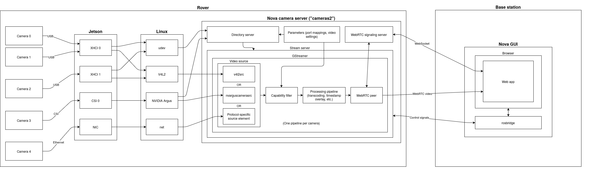

# Cameras2
The Nova Rover Camera Backend

## Camera Notion page:
https://www.notion.so/Cameras-2c931d3a1cab422597317afac5d488bf

## Camera Flow Diagram

Further details on specific pipelines can be seen in [./research/camera_source_formats/README.md](./research/camera_source_formats/README.md)

### `camera_streamer_service.py`
This node creates multiple services which interact directly with the GUI its functions include:
- Creating gstreamer pipelines for each camera
- Responding to service requests for starting and stopping each pipeline
- Ingesting parameters relating to platform and configuration and applying them to the cameras

### `camera_directory_service.py` and `base_camera_directory_service.py`
The `camera_directory_service.py` node calls `camera_scanner.py` and uses its results to broadcast information about available cameras via `base_camera_directory_service.py` on `/camera_directory/cameras`

### `camera_scanner.py`
This script scans udev rules for devices with "capture" capability, essentially finding all possible camera devices on the linux system. 
It also applies the serial override parameters to found cameras allowing the server to address each camera uniquely. (Important for Microsoft LifeCam HD 3000)

### `camera_webrtc_bin.py`
This script creates a gstreamer pipeline, responsible for converting the incoming video format into a webrtc service using GstWebRTCSink (See [Here](./research/camera_source_formats/README.md))

### `utils.py`
This script contains some utility idk.

### Anthony's Rambling
Essentially, the *directory service node* scans for cameras on udev, and broadcasts them on the `/camera_directory/cameras` topic. Then the *streamer service node* prepares a gstreamer pipeline for each camera, which gets activated by the GUI with a ROS service call. The gstreamer pipeline ends with a webrtc sink which communicates with the gst-streamer-service. This then follows the webrtc protocol and communicates to the GUI directly, allowing video stream to pass to the GUI for viewing.

Importantly, the IP of base and rover must be correct on the GUI as well as having **rosbridge** running so that ros topics can be communicated to it. Additionally, due to some sort of issue with non-localhost communication, a stunserver may be needed if the GUI is not on the same device as cameras2 (specifically using firefox).

## Ros Image Topic to GUI:
Cameras2 supports converting ROS Image topics and sending to the GUI.
Backend code is implemented in `camera_ros_streamer.py` and can be launched using `ros_topic_streamer.launch.py`

### Launch File
To make your own launch file, the following nodes need to be running for it to work:
- gst-webrtc-signalling-server
    This node is actually not in the executable path, so it needs to be patched by nix using a patch, see the default.nix for cameras2 for more details
- camera_ros_streamer
    This is the all in one node that will subscribe to the Image topics and send them to the GUI. It relies on a param file that must be supplied in the form:
```yaml
ros_streamer: # name of the ros node
  ros__parameters:
    cameras: oak-rgb bootie-rgb # name of each camera param header separated by a space
    oak-rgb:                    # name of the camera (doesn't have to be the same as the serial)
      topic: /oak/rgb/image_raw # ROS topic of the camera
      serial: oak-rgb           # camera serial used in GUI to find the camera
    bootie-rgb:
      topic: /bootie/rgb/image_raw
      serial: bootie-rgb
```

### `camera_ros_streamer.py`
This node is a combination of the following nodes, adapted for this specific purpose:
- `camera_directory_service.py`
- `camera_streamer_service.py`
- `camera_webrtc_bin.py`

It runs a gstreamer pipeline with individual "pipes" for each camera specified in the yaml file.\
For these to be seen by the GUI it broadcasts to the `/camera_directory/cameras` topic which the GUI subscribes to via **rosbridge**.\
Each gstreamer pipeline consists of multiple gstreamer elements, the `rosimagesrc` element is the most significant as it subscribes to the given ros topic and adds it to the stream. This element comes from the `ros_gst_bridge` plugin.\
Currently this node does not support depth images but this could be allowed for via changes to the pipeline.\
The node also creates stream start, pause and stop services which the GUI sends messages to which changes the gstreamer pipeline's state which begins, pauses and ends data streams.

### How to run with GUI
1. Ensure GUI is running first with **rosbridge**
2. Run the publisher to your image topic
3. Run the launch file\
    a. Launch the gst-signalling-server\
    b. Run the camera_ros_streamer.py 
4. On GUI, in the Cameras2 control panel, click start streaming or the play button
5. On GUI, in the main viewing area, click the play button on the camera box.

### **Important** notes:
- This node currently does not work with depth images
- Debug the gstreamer pipeline by prepending to the launch command `GST_DEBUG=#` 
  - where # can be a number from 1 to 5
- The camera name/header in the yaml does not need to match the serial
- Ensure that your has a camera component looking for the serial specified in the yaml file