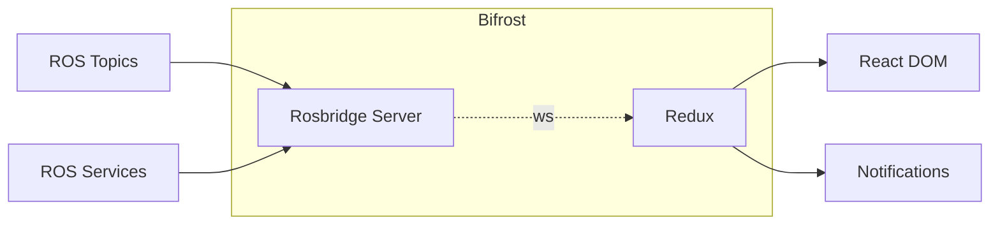

## Nova-GUI

Nova-GUI is the Primary Means of Communication and Control of the Rover During Operation and this repo contains the end to end implementation of the Graphical User Interface for the Rover. Nova-GUI is designed to be modular in nature, where Layouts are composed using Individul Components which work independent of each other.

### Tech Stack

Nova-GUI is a React Powered Webapp which uses the following

- [Rosbridge Suite](https://wiki.ros.org/rosbridge_suite) for Connecting to ROS.
- The Frontend Uses [ReactJS](https://react.dev/) with [NextUI](https://nextui.org/) for the User Interface.
- [Redux-Toolkit](https://redux-toolkit.js.org/) for Complex State Management.
- [Tailwind CSS](https://tailwindcss.com/) along with [styled-components](https://styled-components.com/)
- [Boostrap Icons](https://icons.getbootstrap.com/) are used for general styling of the Page.
- [React Hot Toasts](https://react-hot-toast.com/) for Toasting Users.

<center>



<i>Architecture of Nova-GUI</i>

</center>

Rosbridge server and redux have been combined and abstracted away for simplicity and agility. The Implementation of Rosbridge combined with redux forms a solid bridge between React and ROS and is hence promptly named <i>[Bifrost](./docs/bifrost.md)</i>. It's worth giving a read on how to use Bifrost to stream information from ROS Topics and Request / Send Commands usiong ROS Services.

### Component Library

Following are the Components that have been developed and can be used for composing Layouts for Different Purposes

<!-- This Section should be a mirror of what's happening on the components directory -->

- [x] PoseDataWidget (Example Component)

### Dev Workflow

For Developing Nova-GUI, the reccomended method of development is using `nova-shell`, which loads in essential dependencies such as `yarn` and `rosbridge_server` and other ROS Stuff that's essential for getting GUI up and running.

1. Enter the shell environment

   ```sh
   nova-shell -A env.nova-gui

   # or (currently working better)

   nova-shell -A pkgs.ros.nova-gui
   ```

2. Link in the generated message definitions

   > Run this whenever the included messages change. Nix will always use the
   > latest version when building the package, which may lead to confusion if
   > your copy is out of date.

   ```sh
   ln -sf "$ROS_TS_DEFINITIONS" nova-gui/src/ros/rosTypes.ts
   ```

3. Start rosbridge

   On ros2 terminal (seperate)

   ```sh
   ros2 launch rosbridge_server rosbridge_websocket_launch.xml
   ```

4. Maps (OPTIONAL)
   On separate terminal

   ```sh
   # Build tileserver (ONLY NEED TO DO FIRST TIME)
   nix-build -I nixpkgs=https://github.com/NixOS/nixpkgs/archive/173b74db07f26344f3517716edd4bff6987b512d.tar.gz -E 'with import <nixpkgs> { }; callPackage ~/nixfiles/packages/other/tileserver-gl-shell { }' -o tileserver-gl-shell

   # Enter tileserver shell
   ./tileserver-gl-shell/bin/tileserver-gl-fhs
   
   # Install tileserver packages (ONLY NEED TO DO FIRST TIME)
   npm install -g --prefix ~/.npm-global tileserver-gl
   
   # Run tileserver
   ~/.npm-global/bin/tileserver-gl
   ```

   You wil also need the offline tiles for URC which are available here: \<INSERT HERE>
