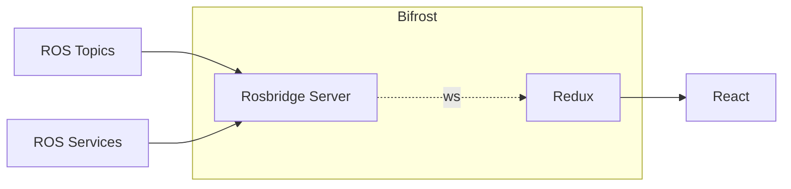

## Nova-GUI

Nova-GUI is the Primary Means of Communication and Control of the Rover During Operation and this repo contains the end to end implementation of the Graphical User Interface for the Rover. Nova-GUI is designed to be modular in nature, where Layouts are composed using Individul Components which work independent of each other.

### Tech Stack

Nova-GUI is a React Powered Webapp connected to ROS using the [Rosbridge Suite](https://wiki.ros.org/rosbridge_suite). The Frontend Uses [ReactJS](https://react.dev/) with [NextUI](https://nextui.org/) for the User Interface and [Redux-Toolkit](https://redux-toolkit.js.org/) for Complex State Management. [Tailwind CSS](https://tailwindcss.com/) along with [styled-components](https://styled-components.com/) are used for general styling of the Page.

<center>



<i>Architecture of Nova-GUI</i></center>

Rosbridge server and redux has been combined and abstracted away for simplicity and agility. The Implementation of Rosbridge combined with redux forms a solid bridge between React and ROS and is hence promptly named <i>[Bifrost](./docs/bifrost.md)</i>. It's worth giving a read on how to use Bifrost to stream information from ROS Topics. (ROS Services are still wip at the time of writing)

### Component Library

Following are the Components that have been developed and can be used for composing Layouts for Different Purposes

<!-- This Section should be a mirror of what's happening on the components directory -->

- [x] PoseDataWidget (Example Component)

### Dev Workflow

For Developing Nova-GUI, the reccomended method of development is using `nova-shell`, which loads in essential dependencies such as `yarn` and `rosbridge_server`.

```sh
nova-shell -A env.nova-gui
```

Alternatively, GUI can be developed on it's own by installing `node` and `yarn` and connecting it to a rosbridge_server (can edit the url which rosbridge listens to on the interface)

```sh
cd ./nova-gui
yarn dev
```

On ros2 terminal (seperate)

```sh
ros2 launch rosbridge_server rosbridge_websockets_launch.xml
```
