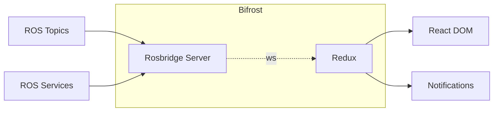

# Nova-GUI

Nova-GUI is the Primary Means of Communication and Control of the Rover During Operation and contains the end to end implementation of the Graphical User Interface for the Rover. Nova-GUI is designed to be modular in nature, where Layouts are composed using Individul Components which work independent of each other.

## Tech Stack

Nova-GUI is a React Powered Webapp which uses the following

- [Rosbridge Suite](https://wiki.ros.org/rosbridge_suite) for Connecting to ROS.
- The Frontend Uses [ReactJS](https://react.dev/) with [NextUI](https://nextui.org/) for the User Interface.
- [Redux-Toolkit](https://redux-toolkit.js.org/) for Complex State Management.
- [Tailwind CSS](https://tailwindcss.com/) along with [styled-components](https://styled-components.com/)
- [Boostrap Icons](https://icons.getbootstrap.com/) are used for general styling of the Page.
- [React Hot Toasts](https://react-hot-toast.com/) for Toasting Users.

<center>



<i>Architecture of Nova-GUI</i>

</center>

Rosbridge server and redux have been combined and abstracted away for simplicity and agility. The Implementation of Rosbridge combined with redux forms a solid bridge between React and ROS and is hence promptly named <i>[Bifrost](./docs/bifrost.md)</i>. It's worth giving a read on how to use Bifrost to stream information from ROS Topics and Request / Send Commands usiong ROS Services.

## Project Structure

```
├─ docs                       # Nova-GUI documentation
├─ nova-gui                   # React project
│   ├─ config files           # Project config files
│   ├─ src/                   # Source code
│   │  ├─ assets              # Images and other assets
│   │  ├─ components          # Component Library
│   │  ├─ hooks               # Custom react hooks
│   │  ├─ ros                 # ROS2 Topic, Action, and Service definitions
│   │  ├─ routes              # GUI routes
│   │  ├─ utils               # Miscellaneous utils
│   │  ├─ views               # Collection of Components that form a page
```

## Dev Workflow

For Developing Nova-GUI, the reccomended method of development is using `nova-shell`, which loads in essential dependencies such as `yarn` and `rosbridge_server` and other ROS Stuff that's essential for getting GUI up and running.

1. Enter the shell environment

   ```sh
   gui-shell 
   # alias for:
   nova-shell -A pkgs.ros.nova-gui
   ```

2. Install the dependencies*

   ```sh
   gui-yarn install
   # alias for:
   yarn --cwd ~/nova/src/ros/nova-gui/nova-gui install
   ```
   Errors are likely caused by network issues. Try setting your DNS and restarting your connection. 

3. Link in the generated message definitions*
   
   This will create a symlink at `nova-gui/src/ros/rosTypes.ts` to the nix store file containing ros type definitions.

   > Run this whenever the included messages change ***including first time running***. Nix will always use the
   > latest version when building the package, which may lead to confusion if
   > your copy is out of date.
   
   ```sh
   gui-link
   # alias for
   ln -sf \"$ROS_TS_DEFINITIONS\" ~/nova/src/ros/nova-gui/nova-gui/src/ros/rosTypes.ts
   ```
   
   If getting `No such file or directory` errors, ensure that the path is correct 
   and the `pkgs.ros.nova-gui` (`gui-shell`) nova shell is used.

4. Launch the gui

   ```sh
   # Launch the server for the gui
   gui-run
   # alias for
   yarn --cwd ~/nova/src/ros/nova-gui/nova-gui dev

   # Open the gui in the browser
   o

   # If you need to launch GUI accessible by other devices on local network
   gui-run --host
   ```

5. Start rosbridge

   Open a new terminal. Rosbridge allows the GUI to interact with the ROS2 network.

   ```sh
   gui-rosbridge
   # alias for
   ~/Builds/master/bin/ros2 launch rosbridge_server rosbridge_websocket_launch.xml
   ```

6. Offline Maps (OPTIONAL)

   Open a new terminal. This runs the maps server that is needed for the URC GPS Cartographer.

   ```sh
   # enter the shell environment
   gui-shell

   gui-tilelink 
   # alias for:
   ln -s ~/nova/src/ros/nova-gui/nova-gui/node_modules/tileserver-gl-styles ~/nova/src/ros/nova-gui/nova-gui/node_modules/tileserver-gl-light/node_modules/tileserver-gl-styles

   # Run tileserver
   gui-tilerun path/to/file.mbtiles
   # alias for:
   yarn --cwd ~/nova/src/ros/nova-gui/nova-gui tileserver-gl-light --file path/to/file.mbtiles
   ```

   If you are getting errors first ensure that the gui and rosbridge is running.

   Instructions for how to find and generate these tiles can be found [here](https://www.notion.so/Creating-Map-Tiles-for-Cartographer-GUI-page-1dab71396171808893f8d37f5410992b).

\* Steps 2 and 3 only need to be run the first time you run the GUI, or whenever a `yarn` dependancy or ROS2 interface respectively changes.
