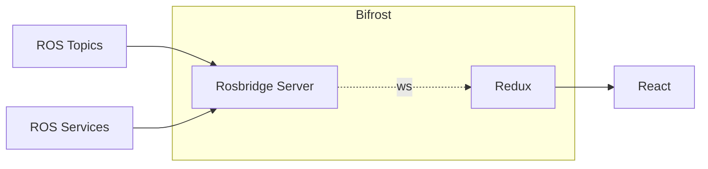

## Bifrost


> The Burning Rainbow bridge that gods use to Travel from Asgard ( the realm of gods ) to all the 8 realms including Midgard ( earth ) is known as [Bifrost](https://en.wikipedia.org/wiki/Bifr%C3%B6st)

In the context of Nova-GUI, Bifrost is the implementation of `roslibjs` and `redux-toolkit` combined to provide seamless access to ROS Topics and Services directly from React Components without worrying about communication, types and other nitty gritty things. `roslibjs` is used to connect to the `rosbridge_server` through means of websockets which enables us to recieve real time updates from ROS.

<center>



</center>

### Bifrost Topics

For Bifrost to recieve updates from a Topic, Bifrost should be aware of the topics that it can listen to. The `ros` directory contains essential information such as Topic name, Message Type (in TS and ROS), etc. For purposes of demonstration, we are adding a the following topic to bifrost

---

Topic Name: `/temp_sensor` (Assuming it sends Temperature Sensor messages)

Message Type (ROS): `core/msg/CustomSensorMsg`

```py
# core/msg/CustomSensorMsg.msg
string feedback;
uint8 temp;
```

---

The following files should be modified inside the `ros` directory.

##### [`rosTopics.ts`](../nova-gui/src/ros/rosTopics.ts)

This File exports a single enum `RosTopics` which is used to point Bifrost at the topic of interest. To add the topic above, we add the following to `Rostopics`.

```ts
TEMP_SENSOR = "/temp_sensor",
```

##### [`rosMessages.ts`](../nova-gui/src/ros/rosMessages.ts)

This file exports an object that links Topics found on `RosTopics.ts` to the message types defined in ROS.This is to ensure that `roslibjs` and `rosbridge_server` are aware of what type of message is being streamed. In this case, we add the following to the object

```ts
export const rosMessages = {
  // Previous Types
  [RosTopics.TEMP_SENSOR]: "core/msg/CustomSensorMsg",
};
```

##### [`rosMessageTypes.ts`](../nova-gui/src/ros/rosMessageTypes.ts)

This file contains types that are equivalent to Message Types defined in ROS. This is to ensure that the Frontend is aware of the Type of Messages being streamed. This file is usually generated by the [ROS TS Generator](https://github.com/Greenroom-Robotics/ros-typescript-generator) ( wip at the moment ). For this example, we add in the type manually by refering to the ROS message

```ts
interface IRosTemperatureMessage {
  feedback: string;
  temp: number;
}
```

##### [`rosTopicTypes.ts`](../nova-gui/src/ros/rosTopicTypes.ts)

This file exports an object that links Topics found on `RosTopics.ts` to the message types defined in Nova-GUI on `rosMessageTypes.ts`. In this case, we add the following to the object

```ts
export interface RosTopicInterfaces {
  // Previous Interfaces
  [RosTopics.TEMP_SENSOR]: IRosTemperatureMessage;
}
```

### Bifrost Store

Data from `rosbridge_server` is stored in redux to be used by the entire app and the singleton object which stores all states is refered as `RootState`. `RootState` contains latest data from all subscribed topics and has additional elements to handle regular redux logic.

For creating a Store for the topic. The Following changes should be made to files inside the `redux` directory.

##### [`RootState.ts`](../nova-gui/src/redux/RootState.ts)

This file contains the Structure of the RootState of the app discussed above. Data from the Topic should Ideally be stored in `temperatureStore` under `RootState`.

```ts
export interface RootState {
  // Previous States
  temperatureStore: IRosTemperatureMessage;
}
```

Remember, this is just the structure. Creating the store is described below.

##### [`RootReducer.ts`](../nova-gui/src/redux/RootState.ts)

This file contains the Reducers for the stores and resembles states on `RootState`. For creating a store for `temperatureStore`, we use the function `createBifrostStore(<Topic>,<Initial State>)`

```ts
export const rootReducer = {
  // Previous Stores
  temperatureStore: createBifrostStore(RosTopics.TEMP_SENSOR, {
    feedback: "",
    temp: 0,
  }),
};
```

Initial State is the data that is displayed till real data comes through `rosbridge_server`.

### Bifrost Usage

To subscribe to topics through Bifrost, we make use of the hooks `useBifrost` and `useSelector`.`useSelector` is from `redux-toolkit` and is used to read values from the store.`useBifrost` invokes Bifrost and points it towards the selected topic (kinda like [this](https://youtu.be/GDsWg_kxfTU?si=RXVpmboKSlbIOMct&t=54)).

```typescript
// Accessing the Store using useSelector hook
const temperatureStore = useSelector(
  (state: Rootstate) => state.temperatureStore
);

// Invoking Bifrost and pointing it towards TEMP_SENSOR
const bifrost = useBifrost(RosTopics.TEMP_SENSOR);

// Wrap with useEffect hook to only run it once
useEffect(() => {
  // call bifrost.syncWithRover() to initiate Realtime Updates
  bifrost.syncWithRover();
}, [bifrost]);

// Use data to your heart's content
return <div>Temperature :{temperatureStore.temp}</div>;
```

### Additional Notes

- Multiple Bifrost Instances can exist on the same Component
- Bifrost is a single laned bridge (like a freeway exit), meaning multiple bifrosts pointing to the same topic will resolve to a single connection between rosbridge and redux.
