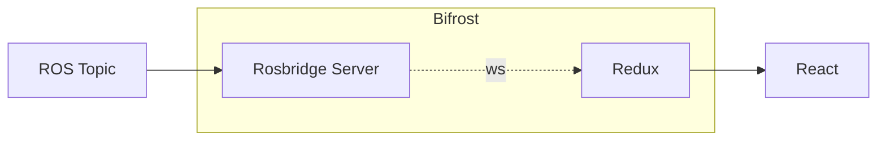

## Nova-GUI Frontend

[Note: This Readme is a work in progress]

This directory is the root directory of the drontend that constitutes Nova-GUI. Basic terminology and Best practices are outlined below.

### Folder Structure

<!-- Taken from #1 -->

The Folder Structure's been Organised into the following

- **assets**: Store all non typescript stuff such as Images, Fonts and other misc stuff
- **routes**: Store all routing related stuff
- **ros**: Store ROS Related stuff. The ROS TS Generator would output to this folder.
- **redux**: All Redux and Bifrost Related Stuff
- **views**: Views in this case refers to the different "Modes". Each view will contain It's Own Layouts and other components which are specific to the purpose.
- **components**: This is our effective component library containing all components used.

### Component Development Lifecycle

Designing and Drafting a Component can include a myriad of Confusion and Ambiguity. This section aims at making this a bit more easy for people to onboard and design their components.

All components on the Components Folder needs to be Generic and Monolithic in Nature, i,e one should be able to use this components across views without any difficulty. All Hooks, functions, enums and types should be stored in the component folder. It's recommended to substructure a component if needed.The shared folder houses components that is used in other components.

A component can do one or more of the following functions

- Stream data from the Rover
- Recieve on demand data from the Rover (like a REST API)
- Send a command to the Rover to perform a Task
- Please the Rover Operator by looking Cute and Cheerfull

Each of these Functions will be explained in detail except for the last one which is a hard requirement

#### Streaming Data from the Rover

Streaming data from the rover is accomplished through a ROS topic.The rover publishes useful data to this topic, which Nova-GUI subscribes to. This allows Nova-GUI to receive real-time updates from the rover about it's position, status,etc.



The Streaming of data from Topics involves communicating to ROS topics through Rosbridge Server. The Frontend is then connected to Rosbridge Server through `roslibjs` which uses websockets to broadcast realtime updates. The data recieved is the stored in redux for app-wide usage. All of this has been abstracted away to an implementation refered as Bifrost.

The first step to narrow down the topics which publish data of interest. Inspect [ros/rosTopics.ts](./src/ros/rosTopics.ts) to check if Bifrost is aware of this topic.

If the topic of interest isin't listed on [ros/rosTopics.ts](./src/ros/rosTopics.ts), refer to this section for adding the topic to Bifrost.

Once the Topic is made available to bifrost, the store has to be created to store the information on redux. Refer to this section for instructions on how to create the store.

The Final step is to actually subscribe to the topic from your component, this can be done seamlessly using the `useBifrost` hook to invoke bifrost.

```typescript
// Accessing the Store using useSelector hook
const data=useSelector((state:Rootstate)=> state.<TOPIC_STORE>)

// Invoking Bifrost and pointing it towards topic of interest.
const bifrost=useBifrost(RosTopics.<TOPIC>)

// Wrap with useEffect hook to only run it once
useEffect(()=>{
   // call bifrost.syncWithRover() to initiate Realtime Updates
   bifrost.syncWithRover()
},[bifrost])

// Use data to your heart's content
return <div>Data :{data}</div> // Todo: Magic

```
