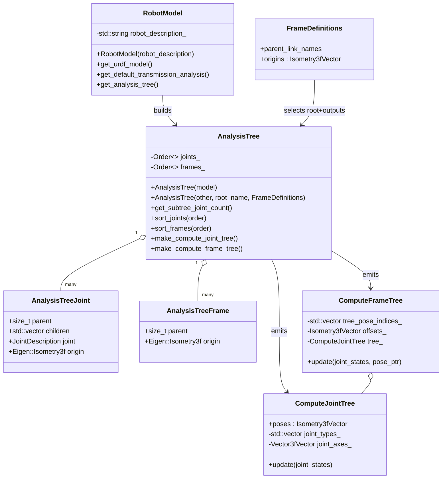
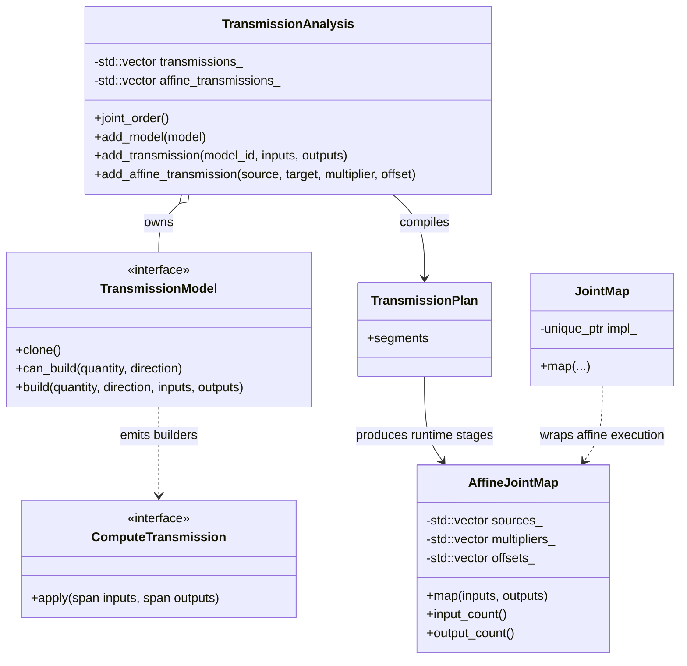
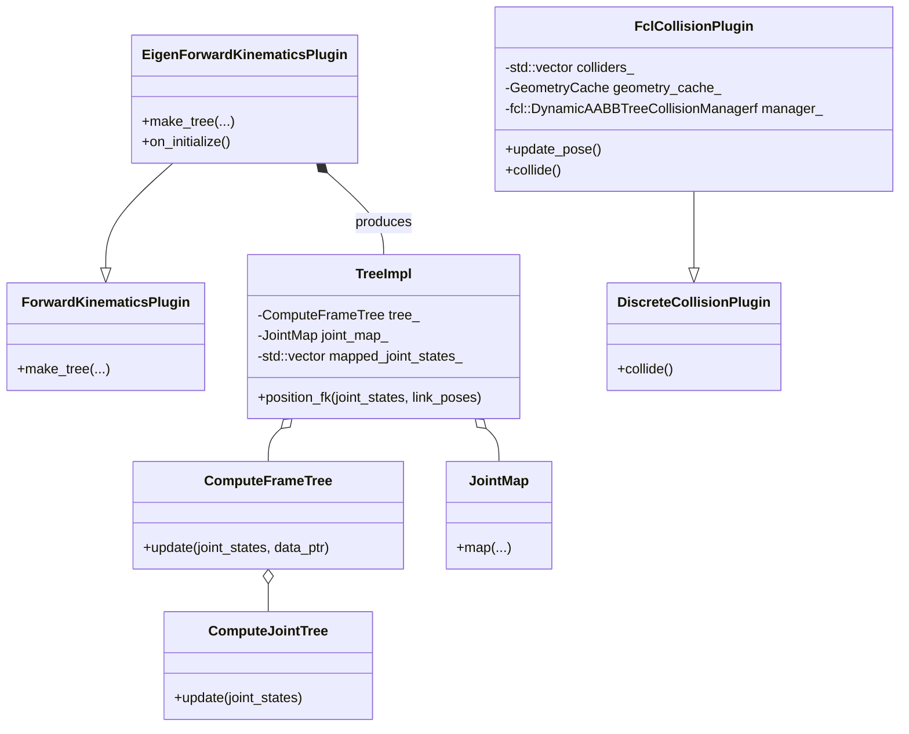

# arm_kinematics UML Overview

This document highlights the core runtime types that actually do the heavy lifting in `arm_kinematics`.
All diagrams use Mermaid so they can be rendered directly from Markdown.

## Model-to-Compute Pipeline

Everything starts with the URDF living inside `RobotModel`. `AnalysisTree` reshapes that model into a topologically
sorted joint+frame graph, supports reductions to new roots, and finally emits the dense compute structures used at
runtime (`ComputeJointTree` and `ComputeFrameTree`). The diagram below focuses on that path rather than controller
helper wrappers.



## Forward Kinematics Execution Types

`ForwardKinematicsPlugin` is just an interface; the real work happens inside the `Tree` objects it produces.
Each tree bundles a `JointMap` for caller → compute ordering, the `ComputeFrameTree` for updating poses, and depends on
analysis-backed builders to maintain consistent transmission policy.

```mermaid
classDiagram
  class ForwardKinematicsPlugin {
    +make_tree(joint_names, base_link, frames, builder)
    +get_transmission_analysis()
    +get_joint_map_builder()
    +on_initialize()*
  }
  class "ForwardKinematicsPlugin::Tree" as FKTree {
    <<interface>>
    +position_fk(joint_states, frame_poses)
  }
  class FrameDefinitions {
    +parent_link_names
    +origins
  }
  class JointMapBuilder {
    <<interface>>
    +build_expected(input_names, output_names, quantity)
  }
  class TransmissionAnalysisJointMapBuilder {
    +build_expected(...)
    -const TransmissionAnalysis & transmission_analysis_
  }
  class TransmissionAnalysis {
    +joint_order()
    +add_transmission(...)
    +add_affine_transmission(...)
  }
  class JointMap {
    +map(inputs, outputs)
    +input_count()
    +output_count()
    -unique_ptr<Concept> impl_
  }
  class ComputeFrameTree {
    +update(joint_states, pose_ptr)
  }
  class ComputeJointTree {
    +update(joint_states)
  }

  ForwardKinematicsPlugin --> FrameDefinitions : consumes
  ForwardKinematicsPlugin --> FKTree : creates
  ForwardKinematicsPlugin --> JointMapBuilder : uses
  JointMapBuilder --> JointMap : constructs
  TransmissionAnalysisJointMapBuilder ..|> JointMapBuilder
  TransmissionAnalysisJointMapBuilder --> TransmissionAnalysis
  FKTree o-- JointMap : remaps states
  FKTree o-- ComputeFrameTree : updates poses
  ComputeFrameTree o-- ComputeJointTree
```

## Joint Mapping and Transmission Analysis

The transmission pipeline is worth calling out separately because it feeds both FK and any other system that needs to
propagate joint-space relationships. This diagram emphasizes the analysis → plan → runtime flow without the higher-level
helpers.



## Collision Infrastructure

Collision checking builds on top of FK by treating colliders as just another set of frames to track. `ColliderDefinitions`
extracts URDF collision elements plus their frame offsets and the initial `AllowedCollisionMatrix`. `CollisionManager`
then couples a FK tree and a `DiscreteCollisionPlugin` implementation.

```mermaid
classDiagram
  class ColliderDefinitions {
    +colliders : vector<urdf::Collision&>
    +frames : FrameDefinitions
    +acm : AllowedCollisionMatrix
  }
  class FrameDefinitions {
    +parent_link_names
    +origins
  }
  class AllowedCollisionMatrix {
    +set(a, b, allowed)
    +get(a, b)
    -std::vector<uint64_t> acm_bits
  }
  class CollisionManager {
    +CollisionManager(tree, plugin)
    +update_poses(joint_states)
    +collide()
    -ForwardKinematicsPlugin::Tree::SharedPtr tree_
    -DiscreteCollisionPlugin::SharedPtr plugin_
    -Isometry3fVector collider_poses_
  }
  class DiscreteCollisionPlugin {
    +initialize(node_ifaces, colliders, acm)
    +update_pose(idx, pose)
    +update_poses(start, poses)
    +collide()
    +collide(colliding_pairs, max_pairs)
    +on_initialize()*
    -AllowedCollisionMatrix acm_
  }
  class FclCollisionPlugin {
    -std::vector<fcl::CollisionObjectf> colliders_
    -GeometryCache geometry_cache_
    -fcl::DynamicAABBTreeCollisionManagerf manager_
  }

  ColliderDefinitions --> FrameDefinitions
  ColliderDefinitions --> AllowedCollisionMatrix
  CollisionManager o-- "1" ForwardKinematicsPlugin::Tree : requires
  CollisionManager o-- DiscreteCollisionPlugin
  DiscreteCollisionPlugin --|> FclCollisionPlugin
```

## Default Plugin Implementations

Finally, here is where the concrete FK and collision plugins slot into the abstractions above. `EigenForwardKinematicsPlugin`
packages `ComputeFrameTree` + `JointMap` into a `TreeImpl`, while `FclCollisionPlugin` provides a `DiscreteCollisionPlugin`
using FCL.



These diagrams now focus on the underlying analysis and runtime types (`AnalysisTree`, `ComputeFrameTree`,
`ForwardKinematicsPlugin::Tree`, `JointMap`, etc.) rather than the optional helpers exposed to controllers.
