# Nova Arm Controller

This controller is able to drive a BLCMD arm in joint space. 

## Controller chaining

Controller chaining allows us to compose a control system from many modular component controllers. In this case, this 
controller is used in tandem with inputs from an IK controller when in IK mode, or from inputs from a ROS2 topic when in 
FK/joint space control mode.

Resources on controller chaining:
- [Controller Chaining / Cascade Control](https://control.ros.org/master/doc/ros2_control/controller_manager/doc/controller_chaining.html#implementation)
- [Example 12: Controller chaining with RRBot](https://control.ros.org/master/doc/ros2_control_demos/example_12/doc/userdoc.html)
- [Example 12 passthrough_controller.hpp](https://github.com/ros-controls/ros2_control_demos/blob/master/example_12/controllers/include/passthrough_controller/passthrough_controller.hpp)
- [Example 12 passthrough_controller.cpp](https://github.com/ros-controls/ros2_control_demos/blob/master/example_12/controllers/src/passthrough_controller.cpp)
- [Chaining Controllers roadmap design document](https://github.com/ros-controls/roadmap/blob/master/design_drafts/controller_chaining.md#example-2)

The controller includes two reference interfaces for each joint; one for velocity, and one for position. 

Where `N` is the number of joints, the first `N` reference interfaces correlate to the velocity for each joint, in the 
order of the joints defined in the parameters. Similarly, the next `N` reference interfaces correspond to position.

```mermaid
---
title: Controller in chained mode 
---
%%{init: {'themeVariables': { 'fontFamily': 'Monospace'}}}%%
flowchart LR
    classDef controller fill:#1f2020,stroke:#cccccc,stroke-width:2px,rx:10,ry:10 
    classDef hidden fill:#00000000,height:0
    classDef elipses fill:#00000000,stroke:#00000000,stroke-width:0,height:0,font-size:32pt

    subgraph reference_interfaces["`Reference
    interfaces`"]
        ref_j1_p(j1/velocity)
        elipses1["⋮"]:::elipses
        ref_j6_p(j6/velocity)
        ref_j1(j1/position)
        ref_j2(j2/position)
        ref_j3(j3/position)
        ref_j4(j4/position)
        ref_j5(j5/position)
        ref_j6(j6/position)
    end
    
    subgraph nova_ik_controller["`nova_ik_controller`"]
        _r_h1["."] ~~~ _r_h1b["."]
        _r_h2["."] ~~~ _r_h2b["."]
        _r_h3["."] ~~~ _r_h3b["."]
        _r_h4["."] ~~~ _r_h4b["."]
        _r_h5["."] ~~~ _r_h5b["."]
        _r_h6["."] ~~~ _r_h6b["."]
    end
    class nova_ik_controller controller;

    subgraph nova_arm_controller["`nova_arm_controller`"]
        _h1["."] 
        _h1b["."]
        _h2["."] 
        _h2b["."]
        _h3["."] 
        _h3b["."]
        _h4["."] 
        _h4b["."]
        _h5["."] 
        _h5b["."]
        _h6["."] 
        _h6b["."]
    end
    class nova_arm_controller controller;

    subgraph hardware_interfaces["`
    Interfaces`"]
    j1(j1/position)
    j2(j2/position)
    j3(j3/position)
    j4(j4/position)
    j5(j5/position)
    j6(j6/position)
    end

    %% Hidden nodes to enforce straight horizontal alignment
    _r_h1b --> ref_j1 --> _h1 ~~~ _h1b -- cmd --> j1
    _r_h2b --> ref_j2 --> _h2 ~~~ _h2b -- cmd --> j2
    _r_h3b --> ref_j3 --> _h3 ~~~ _h3b -- cmd --> j3
    _r_h4b --> ref_j4 --> _h4 ~~~ _h4b -- cmd --> j4
    _r_h5b --> ref_j5 --> _h5 ~~~ _h5b -- cmd --> j5
    _r_h6b --> ref_j6 --> _h6 ~~~ _h6b -- cmd --> j6

    class _h1,_h1b,_r_h1,_r_h1b hidden;
    class _h2,_h2b,_r_h2,_r_h2b hidden;
    class _h3,_h3b,_r_h3,_r_h3b hidden;
    class _h4,_h4b,_r_h4,_r_h4b hidden;
    class _h5,_h5b,_r_h5,_r_h5b hidden;
    class _h6,_h6b,_r_h6,_r_h6b hidden;
```

```mermaid
---
title: Controller **not** in chained mode
---
%%{init: {'themeVariables': { 'fontFamily': 'Monospace'}}}%%
flowchart LR
    classDef controller fill:#1f2020,stroke:#cccccc,stroke-width:2px,rx:10,ry:10 
    classDef hidden fill:#00000000,height:0
    classDef elipses fill:#00000000,stroke:#00000000,stroke-width:0,height:0,font-size:32pt
        
    _h["."] ~~~ subscription["`ROS2 topic subscription`"] ~~~ _hb["."]

    subgraph reference_interfaces["`Reference
    interfaces`"]
            
        ref_j1(j1/velocity)
        ref_j2(j2/velocity)
        ref_j3(j3/velocity)
        ref_j4(j4/velocity)
        ref_j5(j5/velocity)
        ref_j6(j6/velocity)
        ref_j1_p(j1/position)
        elipses1["⋮"]:::elipses
        ref_j6_p(j6/position)
    end
    
    subgraph nova_arm_controller["`nova_arm_controller`"]
            
        _h1["."]
        _h1c["."]
        _h1b["."]
        
        _h2["."]
        _h2c["."]
        _h2b["."]
        
        _h3["."]
        _h3c["."]
        _h3b["."]
        
        
        
        _h4["."]
        _h4c["."]
        _h4b["."]
        
        _h5["."]
        _h5c["."]
        _h5b["."]
        
        _h6["."]
        _h6c["."]
        _h6b["."]
            
    end
    class nova_arm_controller controller;

    subgraph hardware_interfaces["`
    Interfaces`"]
        j1(j1/velocity)
        j2(j2/velocity)
        j3(j3/velocity)
        j4(j4/velocity)
        j5(j5/velocity)
        j6(j6/velocity)
    end

%% Hidden nodes to enforce straight horizontal alignment
    _h3 ~~~ _h3b    
    _h4 ~~~ _h4b    
        
        
    ref_j1 --> _h1 ~~~ _h1c ~~~ _h1b -- cmd --> j1
    ref_j2 --> _h2 ~~~ _h2c ~~~ _h2b -- cmd --> j2
    ref_j3 --> _h3 ~~~ _h3c ~~~ _h3b -- cmd --> j3
    ref_j4 --> _h4 ~~~ _h4c ~~~ _h4b -- cmd --> j4
    ref_j5 --> _h5 ~~~ _h5c ~~~ _h5b -- cmd --> j5
    ref_j6 --> _h6 ~~~ _h6c ~~~ _h6b -- cmd --> j6
        
    subscription -.-> ref_j1
    subscription -.-> ref_j2
    subscription -.-> ref_j3
    subscription -.-> ref_j4
    subscription -.-> ref_j5
    subscription -.-> ref_j6


    class _h,_hb,topic hidden;
    class _h1,_h1b,_h1c,_r_h1b hidden;
    class _h2,_h2b,_h2c,_r_h2b hidden;
    class _h3,_h3b,_h3c,_r_h3b hidden;
    class _h4,_h4b,_h4c,_r_h4b hidden;
    class _h5,_h5b,_h5c,_r_h5b hidden;
    class _h6,_h6b,_h6c,_r_h6b hidden;
```

